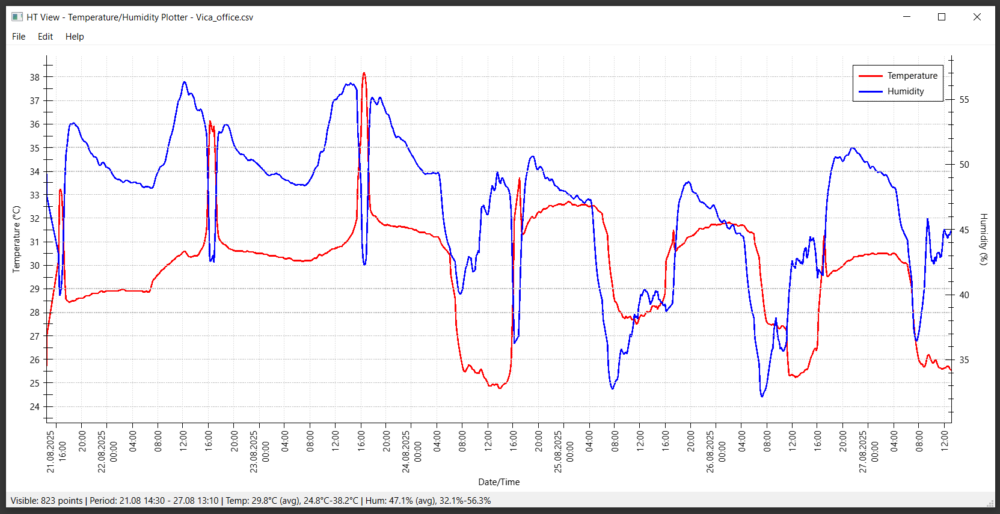

# HT View - Temperature & Humidity Data Viewer

**Version:** 1.0  
**Author:** Temperature & Humidity Monitor Team  
**License:** Freeware  

## Overview

HT View is a powerful desktop application for visualizing and analyzing temperature and humidity data from CSV files. It features an intuitive interface with interactive charts, multiple time scale views, and export capabilities.


*Main interface showing temperature and humidity charts with interactive controls*

## Features

### 📊 Data Visualization

- **Interactive Charts** - Zoom, pan, and explore your data
- **Dual-axis Display** - Temperature and humidity on separate scales
- **Real-time Updates** - Automatic chart refresh when data changes
- **Multiple Time Scales** - Day, week, month, and custom ranges

### 📁 File Support

- **CSV Import** - Standard comma-separated values format
- **Auto-detection** - Automatically detects timestamp and data columns
- **Multiple Formats** - Supports various date/time formats
- **Large Files** - Efficient handling of datasets with thousands of points

### 💾 Export & Print

- **PNG Export** - High-quality image export
- **PDF Export** - Vector-based PDF output
- **Print Support** - Direct printing with customizable layouts
- **Custom Resolution** - Adjustable export quality

### ⚡ Performance

- **Fast Rendering** - Optimized for large datasets
- **Memory Efficient** - Low memory footprint
- **Responsive UI** - Smooth interaction even with big files

## Getting Started

### Installation

1. Download `HT_View_Setup.exe`
2. Run the installer (requires administrator rights)
3. Follow the installation wizard
4. Launch from Start Menu or desktop shortcut

### Portable Version

1. Download `HT_View_Portable.zip`
2. Extract to any folder
3. Run `HT_view.exe` directly

### First Use

1. **Open CSV File** - Click "Open" or use Ctrl+O
2. **View Data** - Charts will automatically display
3. **Navigate** - Use mouse wheel to zoom, drag to pan
4. **Switch Views** - Use keyboard shortcuts D/W/M

## User Interface

### Main Window

```
┌─── Menu Bar ────────────────────────────────────────┐
│ File  View  Export  Help                            │
├─────────────────────────────────────────────────────┤
│ [Open] [Day] [Week] [Month] [Export] [Print]        │
├─────────────────────────────────────────────────────┤
│                                                     │
│              Temperature Chart                      │
│  30°C ┌─────────────────────────────────────┐       │
│       │   ∿∿∿∿∿∿∿∿∿∿∿∿∿∿∿∿∿∿∿∿∿∿∿∿∿∿∿   │       │
│  20°C │ ∿∿                              ∿∿∿│       │
│       └─────────────────────────────────────┘       │
│                                                     │
│              Humidity Chart                         │
│  80%  ┌─────────────────────────────────────┐       │
│       │      ^^^^^^^^^^^^^^^^^^^^^^^^^^^^   │       │
│  60%  │    ^^                        ^^     │       │
│       └─────────────────────────────────────┘       │
│                                                     │
├─────────────────────────────────────────────────────┤
│ Status: 1,234 data points | Range: 2024-01-01 to    │
│ 2024-01-31 | File: sensor_data.csv                  │
└─────────────────────────────────────────────────────┘
```

### Controls

#### Menu Bar

- **File**
  
  - `Open...` (Ctrl+O) - Load CSV file
  - `Recent Files` - Quick access to recent files
  - `Exit` (Alt+F4) - Close application

- **View**
  
  - `Day View` (D) - Show last 24 hours
  - `Week View` (W) - Show last 7 days
  - `Month View` (M) - Show last 30 days
  - `Custom Range...` - Set specific date range
  - `Refresh` (F5) - Reload current file

- **Export**
  
  - `Export as PNG...` - Save chart as image
  - `Export as PDF...` - Save chart as PDF
  - `Print...` (Ctrl+P) - Print charts

- **Help**
  
  - `About` - Application information
  - `User Guide` - Open this README

#### Toolbar Buttons

- **📁 Open** - Load CSV file
- **📅 Day** - Switch to day view
- **📅 Week** - Switch to week view  
- **📅 Month** - Switch to month view
- **💾 Export** - Quick export menu
- **🖨️ Print** - Print current view

#### Mouse Controls

- **Scroll Wheel** - Zoom in/out
- **Left Click + Drag** - Pan chart
- **Right Click** - Context menu
- **Double Click** - Reset zoom

#### Keyboard Shortcuts

| Key      | Action          |
| -------- | --------------- |
| `Ctrl+O` | Open file       |
| `Ctrl+P` | Print           |
| `F5`     | Refresh         |
| `D`      | Day view        |
| `W`      | Week view       |
| `M`      | Month view      |
| `Ctrl++` | Zoom in         |
| `Ctrl+-` | Zoom out        |
| `Ctrl+0` | Reset zoom      |
| `Esc`    | Exit fullscreen |

## Configuration

### config.ini File

The application uses a configuration file `config.ini` located in the same directory as the executable. This file stores CSV parsing settings and data format configurations.

#### File Location

- **Installed Version:** `C:\Program Files\HT View\config.ini`
- **Portable Version:** Same folder as `HT_view.exe`

#### Configuration Structure

```ini
[PARSER]
; CSV parsing patterns for different data formats

; For DateTime format (human-readable timestamps)
; Example: DateTime('Mon, Jan 01 2024 12:30');23.5;65.2;OK
DateTimePattern=DateTime('ddd, MMM dd yyyy HH:mm');%f;%f;%s

; For Unix timestamp format (numeric timestamps)
; Example: 1704110400;23.5;65.2
TimestampPattern=%d;%f;%f

; Active parsing pattern (DateTime or Timestamp)
ActivePattern=DateTime
```

#### Format Patterns Explained

**Pattern Symbols:**

- `%f` = Floating point number (temperature/humidity values)
- `%d` = Integer (Unix timestamp)
- `%s` = String (status or additional text)

**DateTime Format:**

- `ddd` = Abbreviated day name (Mon, Tue, Wed...)
- `MMM` = Abbreviated month name (Jan, Feb, Mar...)
- `dd` = Day of month (01-31)
- `yyyy` = 4-digit year (2024)
- `HH:mm` = 24-hour time (12:30)

#### Supported CSV Formats

**Format 1: DateTime with Status**

```csv
DateTime('Mon, Jan 01 2024 08:00');22.1;68.5;OK
DateTime('Mon, Jan 01 2024 08:30');22.3;68.2;OK
DateTime('Mon, Jan 01 2024 09:00');22.8;67.8;OK
```

**Format 2: Unix Timestamp**

```csv
1704088800;22.1;68.5
1704090600;22.3;68.2
1704092400;22.8;67.8
```

#### Customizing CSV Parsing

**For Tab-Separated Values:**

```ini
[PARSER]
DateTimePattern=DateTime('ddd, MMM dd yyyy HH:mm')\t%f\t%f\t%s
TimestampPattern=%d\t%f\t%f
ActivePattern=DateTime
```

**For Different DateTime Format:**

```ini
[PARSER]
; For format: "2024-01-01 08:00:00;22.1;68.5"
DateTimePattern=yyyy-MM-dd HH:mm:ss;%f;%f
ActivePattern=DateTime
```

**For Different Column Order:**

```ini
[PARSER]
; For format: "22.1;68.5;DateTime('Mon, Jan 01 2024 08:00')"
DateTimePattern=%f;%f;DateTime('ddd, MMM dd yyyy HH:mm')
ActivePattern=DateTime
```

#### Switching Between Formats

To switch between DateTime and Unix timestamp formats:

1. Open `config.ini` in any text editor
2. Change `ActivePattern=DateTime` to `ActivePattern=Timestamp` (or vice versa)
3. Save the file
4. Restart HT View or press F5 to reload

#### Application Settings (Auto-Generated)

The application may also create additional sections for user preferences:

```ini
[Window]
# Window size and position (auto-saved)
Width=1200
Height=800
X=100
Y=100
Maximized=false

[Recent]
# Recently opened files (auto-managed)
File1=C:\Data\sensor_2024.csv
File2=C:\Data\temperature_log.csv
MaxRecentFiles=10
```

These sections are automatically managed by the application and don't require manual editing.

## CSV File Format

#### Standard Format

```csv
Timestamp,Temperature,Humidity
2024-01-01 00:00:00,23.5,65.2
2024-01-01 00:30:00,23.8,64.8
2024-01-01 01:00:00,24.1,64.5
```

#### Supported Date Formats

- `yyyy-MM-dd hh:mm:ss` (2024-01-01 12:30:00)
- `dd/MM/yyyy hh:mm` (01/01/2024 12:30)
- `MM-dd-yyyy hh:mm:ss` (01-01-2024 12:30:00)
- `yyyy/MM/dd hh:mm` (2024/01/01 12:30)

#### Alternative Separators

- Comma (`,`) - Default
- Semicolon (`;`) - European standard
- Tab (`\t`) - Tab-separated values

#### Example CSV Files

**Your Current Format (DateTime):**

```csv
DateTime('Mon, Jan 01 2024 08:00');22.1;68.5;OK
DateTime('Mon, Jan 01 2024 08:30');22.3;68.2;OK
DateTime('Mon, Jan 01 2024 09:00');22.8;67.8;Warning
```

**Alternative Format (Unix Timestamp):**

```csv
1704088800;22.1;68.5
1704090600;22.3;68.2
1704092400;22.8;67.8
```

**Configuration for Your Format:**

```ini
[PARSER]
DateTimePattern=DateTime('ddd, MMM dd yyyy HH:mm');%f;%f;%s
ActivePattern=DateTime
```

#### Example Files

**Basic Format:**

```csv
Time,Temp,Hum
2024-01-01 08:00,22.1,68.5
2024-01-01 08:30,22.3,68.2
2024-01-01 09:00,22.8,67.8
```

**Extended Format:**

```csv
Date;Time;Temperature(°C);Humidity(%);Pressure(hPa)
01/01/2024;08:00:00;22.1;68.5;1013.2
01/01/2024;08:30:00;22.3;68.2;1013.1
01/01/2024;09:00:00;22.8;67.8;1013.0
```

## Troubleshooting

### Common Issues

**Q: Charts are not displaying**

- Check CSV file format matches expected structure
- Verify timestamp column contains valid dates
- Ensure temperature/humidity columns contain numeric values

**Q: Application crashes on startup**

- Delete `config.ini` to reset to defaults
- Check file permissions in installation directory
- Reinstall application

**Q: CSV file won't open**

- Verify file is not empty
- Check file is not locked by another application
- Try different separator settings in config.ini

**Q: Charts are slow with large files**

- Reduce `MaxDataPoints` in config.ini
- Use time range filtering (Day/Week view)
- Consider splitting large files

**Q: Export images are blurry**

- Increase `ImageDPI` in config.ini
- Use larger `ImageWidth` and `ImageHeight`
- Try PDF export for vector graphics

### Performance Tips

1. **Large Files** - Use custom time ranges instead of viewing all data
2. **Memory** - Restart application periodically with very large datasets
3. **Rendering** - Disable anti-aliasing for faster display: `AntiAliasing=false`
4. **Auto-refresh** - Disable for static files: `AutoRefresh=false`

### File Associations

After installation, CSV files can be opened directly with HT View:

- Right-click CSV file → "Open with" → "HT View"
- Double-click CSV files (if set as default)
- Drag and drop CSV files onto HT View window

## System Requirements

### Minimum Requirements

- **OS:** Windows 10 (64-bit)
- **RAM:** 4 GB
- **Disk:** 50 MB free space
- **Display:** 1024x768 resolution

### Recommended Requirements

- **OS:** Windows 11 (64-bit)
- **RAM:** 8 GB or more
- **Disk:** 100 MB free space
- **Display:** 1920x1080 resolution or higher

## Technical Information

### Built With

- **Qt 6.6.0** - Cross-platform application framework
- **QCustomPlot** - High-performance plotting library
- **Visual Studio 2022** - MSVC compiler
- **CMake** - Build system

### File Structure

```
HT View/
├── HT_view.exe           # Main application
├── config.ini            # Configuration file
├── README.md             # This documentation
├── Qt6Core.dll           # Qt framework libraries
├── Qt6Gui.dll
├── Qt6Widgets.dll
├── Qt6PrintSupport.dll
├── platforms/            # Platform plugins
│   └── qwindows.dll
├── imageformats/         # Image format plugins
│   ├── qjpeg.dll
│   ├── qpng.dll
│   └── ...
└── styles/               # UI style plugins
    └── qwindowsvistastyle.dll
```

## Version History

### Version 1.0 (2024-08-27)

- Initial release
- CSV file import
- Interactive charts
- Multiple time scale views
- PNG/PDF export
- Print support
- Configuration system

## Support & Contact

### Getting Help

1. Check this README file
2. Review configuration settings
3. Try resetting config.ini
4. Contact support team

### Known Limitations

- CSV files only (no Excel support)
- Maximum 100,000 data points per file
- Windows only (no Mac/Linux versions)
- English interface only

### Future Plans

- Excel file support
- Multiple sensor data
- Data analysis tools
- Alarm thresholds
- Database connectivity

---

**Thank you for using HT View!**

For questions or feedback, please contact the development team.