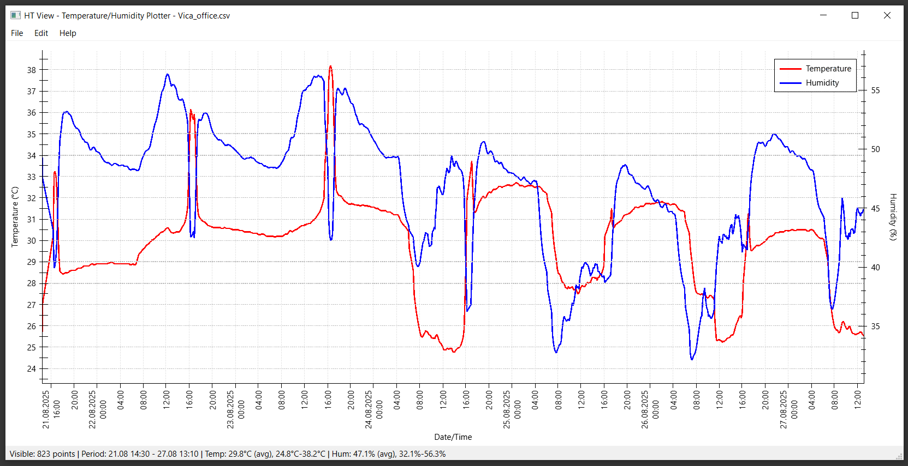

# HT View - Temperature & Humidity Data Viewer

**Version:** 1.0  
**Author:** Temperature & Humidity Monitor Team  
**License:** Freeware  

## Overview

HT View is a powerful desktop application for visualizing and analyzing temperature and humidity data from CSV files. It features an intuitive interface with interactive charts, multiple time scale views, and export capabilities.


*Main interface showing temperature and humidity charts with interactive controls*

## Features

### 📊 Data Visualization

- **Interactive Charts** - Zoom, pan, and explore your data
- **Dual-axis Display** - Temperature and humidity on separate scales
- **Real-time Updates** - Automatic chart refresh when data changes
- **Multiple Time Scales** - Day, week, month, and custom ranges

### 📁 File Support

- **CSV Import** - Standard comma-separated values format
- **Auto-detection** - Automatically detects timestamp and data columns
- **Multiple Formats** - Supports various date/time formats
- **Large Files** - Efficient handling of datasets with thousands of points

### 💾 Export & Print

- **PNG Export** - High-quality image export
- **PDF Export** - Vector-based PDF output
- **Print Support** - Direct printing with customizable layouts
- **Custom Resolution** - Adjustable export quality

### ⚡ Performance

- **Fast Rendering** - Optimized for large datasets
- **Memory Efficient** - Low memory footprint
- **Responsive UI** - Smooth interaction even with big files

## Getting Started

### Installation

1. Download `HT_View_Setup.exe`
2. Run the installer (requires administrator rights)
3. Follow the installation wizard
4. Launch from Start Menu or desktop shortcut

### Portable Version

1. Download `HT_View_Portable.zip`
2. Extract to any folder
3. Run `HT_view.exe` directly

### First Use

1. **Open CSV File** - Click "Open" or use Ctrl+O
2. **View Data** - Charts will automatically display
3. **Navigate** - Use mouse wheel to zoom, drag to pan
4. **Switch Views** - Use keyboard shortcuts D/W/M

## User Interface

### Main Window

```
┌─── Menu Bar ────────────────────────────────────────┐
│ File  View  Export  Help                            │
├─────────────────────────────────────────────────────┤
│ [Open] [Day] [Week] [Month] [Export] [Print]        │
├─────────────────────────────────────────────────────┤
│                                                     │
│              Temperature Chart                      │
│  30°C ┌─────────────────────────────────────┐       │
│       │   ∿∿∿∿∿∿∿∿∿∿∿∿∿∿∿∿∿∿∿∿∿∿∿∿∿∿∿   │       │
│  20°C │ ∿∿                              ∿∿∿│       │
│       └─────────────────────────────────────┘       │
│                                                     │
│              Humidity Chart                         │
│  80%  ┌─────────────────────────────────────┐       │
│       │      ^^^^^^^^^^^^^^^^^^^^^^^^^^^^   │       │
│  60%  │    ^^                        ^^     │       │
│       └─────────────────────────────────────┘       │
│                                                     │
├─────────────────────────────────────────────────────┤
│ Status: 1,234 data points | Range: 2024-01-01 to    │
│ 2024-01-31 | File: sensor_data.csv                  │
└─────────────────────────────────────────────────────┘
```

### Controls

#### Menu Bar

- **File**
  
  - `Open...` (Ctrl+O) - Load CSV file
  - `Recent Files` - Quick access to recent files
  - `Exit` (Alt+F4) - Close application

- **View**
  
  - `Day View` (D) - Show last 24 hours
  - `Week View` (W) - Show last 7 days
  - `Month View` (M) - Show last 30 days
  - `Custom Range...` - Set specific date range
  - `Refresh` (F5) - Reload current file

- **Export**
  
  - `Export as PNG...` - Save chart as image
  - `Export as PDF...` - Save chart as PDF
  - `Print...` (Ctrl+P) - Print charts

- **Help**
  
  - `About` - Application information
  - `User Guide` - Open this README

#### Toolbar Buttons

- **📁 Open** - Load CSV file
- **📅 Day** - Switch to day view
- **📅 Week** - Switch to week view  
- **📅 Month** - Switch to month view
- **💾 Export** - Quick export menu
- **🖨️ Print** - Print current view

#### Display Controls

- **P Key** - Toggle between Lines and Points display modes
  - **Lines Mode** - Smooth connected lines (default)
  - **Points Mode** - Individual data points without smoothing
- **T Key** - Show/hide Temperature graph
- **H Key** - Show/hide Humidity graph

#### Navigation Controls

- **Arrow Keys** - Navigate and zoom
  - **Left/Right** - Move timeline forward/backward
  - **Shift+Left/Right** - Smooth horizontal panning
  - **Up/Down** - Pan graphs vertically
  - **Shift+Up/Down** - Zoom in/out vertically
- **Time Scale** - Switch between different time ranges
  - **D** - Day view (24 hours)
  - **W** - Week view (7 days)  
  - **M** - Month view (30 days)
- **Quick Navigation**
  - **Home** - Jump to start of data
  - **End** - Jump to end of data
  - **Shift+Home** - Reset all zoom to fit data
  - **PgUp/PgDn** - Jump to period boundaries (day/week/month edges)

#### Mouse Controls

- **Mouse Wheel** - Zoom time axis in/out
- **Left Click + Drag** - Pan chart horizontally
- **Shift + Mouse Move** - Show crosshair with precise values
- **Right Click** - Context menu (future feature)

#### Keyboard Shortcuts

| Key           | Action                           |
| ------------- | -------------------------------- |
| `Ctrl+O`      | Open file                        |
| `Ctrl+P`      | Print                           |
| `Ctrl+E`      | Export chart                    |
| `F5`          | Refresh                         |
| **Navigation** |                                |
| `D`           | Day view                        |
| `W`           | Week view                       |
| `M`           | Month view                      |
| `Left/Right`  | Navigate timeline               |
| `Shift+Left/Right` | Smooth pan horizontally    |
| `Up/Down`     | Pan graphs vertically           |
| `Shift+Up/Down` | Zoom in/out vertically        |
| `Home`        | Go to start of data             |
| `End`         | Go to end of data               |
| `Shift+Home`  | Reset all zoom                  |
| `PgUp/PgDn`   | Jump to period boundaries       |
| **Display**   |                                |
| `P`           | Toggle Points/Lines mode        |
| `T`           | Toggle Temperature graph        |
| `H`           | Toggle Humidity graph           |
| **Mouse**     |                                |
| `Shift+Mouse` | Show crosshair with values      |
| `Mouse Wheel` | Zoom time axis                  |

## Configuration

### config.ini File

The application uses a configuration file `config.ini` located in the same directory as the executable. This file stores CSV parsing settings, data format configurations, and visualization preferences.

#### File Location

- **Installed Version:** `C:\Program Files\HT View\config.ini`
- **Portable Version:** Same folder as `HT_view.exe`

#### Configuration Structure

```ini
[PARSER]
; CSV parsing patterns for different data formats

; For DateTime format (human-readable timestamps)
; Example: DateTime('Mon, Jan 01 2024 12:30');23.5;65.2;OK
DateTimePattern=DateTime('ddd, MMM dd yyyy HH:mm');%f;%f;%s

; For Unix timestamp format (numeric timestamps)
; Example: 1704110400;23.5;65.2
TimestampPattern=%d;%f;%f

; Active parsing pattern (DateTime or Timestamp)
ActivePattern=DateTime

[VISUALIZATION]
; Chart appearance and behavior settings

; Colors (in #RRGGBB format)
TemperatureColor=#FF0000
HumidityColor=#0000FF
GridColor=#D3D3D3
CrosshairColor=#A9A9A9

; Line thickness (in pixels)
TemperatureLineWidth=2
HumidityLineWidth=2
GridLineWidth=1
CrosshairLineWidth=1

; Data smoothing settings
SmoothingWindow=5
EnableSmoothing=true

; Point size for Points display mode
PointSize=4

; Transparency (0-255, where 255 is fully opaque)
GridOpacity=255
CrosshairOpacity=200
```

#### Visualization Settings Explained

**Colors:**
- Use standard HTML color codes (#RRGGBB format)
- Examples: `#FF0000` (red), `#0000FF` (blue), `#00FF00` (green)
- Online color picker tools can help choose custom colors

**Line Thickness:**
- Values in pixels (1-10 recommended)
- Thicker lines are more visible but may overlap
- Use 1 for grid lines, 2-3 for data lines

**Data Smoothing:**
- `SmoothingWindow`: Number of points to average (1-20)
  - Higher values = smoother lines, less detail
  - Lower values = more detail, less smoothing
  - Set to 0 or 1 to disable smoothing
- `EnableSmoothing`: `true` or `false`
  - Controls whether smoothing is applied at all
  - When `false`, raw data is always used

**Point Size:**
- Size of points in Points display mode (1-10 pixels)
- Larger values make points more visible
- Smaller values for dense data

**Transparency:**
- Values from 0 (invisible) to 255 (fully opaque)
- Lower values make elements more subtle
- Higher values make elements more prominent

#### Example Configurations

**High Contrast Theme:**
```ini
[VISUALIZATION]
TemperatureColor=#FF0000
HumidityColor=#0000FF
GridColor=#808080
CrosshairColor=#000000
TemperatureLineWidth=3
HumidityLineWidth=3
GridLineWidth=1
CrosshairLineWidth=2
SmoothingWindow=1
EnableSmoothing=false
PointSize=6
GridOpacity=128
CrosshairOpacity=255
```

**Subtle/Minimal Theme:**
```ini
[VISUALIZATION]
TemperatureColor=#FF6B6B
HumidityColor=#4ECDC4
GridColor=#F0F0F0
CrosshairColor=#CCCCCC
TemperatureLineWidth=1
HumidityLineWidth=1
GridLineWidth=1
CrosshairLineWidth=1
SmoothingWindow=10
EnableSmoothing=true
PointSize=2
GridOpacity=100
CrosshairOpacity=150
```

**No Smoothing (Raw Data):**
```ini
[VISUALIZATION]
TemperatureColor=#FF0000
HumidityColor=#0000FF
GridColor=#D3D3D3
CrosshairColor=#A9A9A9
TemperatureLineWidth=2
HumidityLineWidth=2
GridLineWidth=1
CrosshairLineWidth=1
SmoothingWindow=0
EnableSmoothing=false
PointSize=4
GridOpacity=255
CrosshairOpacity=200
```

#### Applying Configuration Changes

1. Close HT View application
2. Edit `config.ini` with any text editor
3. Save the file
4. Restart HT View
5. Changes will be applied automatically

**Note:** Invalid color codes or values will revert to defaults.

## CSV File Format

#### Standard Format

```csv
Timestamp,Temperature,Humidity
2024-01-01 00:00:00,23.5,65.2
2024-01-01 00:30:00,23.8,64.8
2024-01-01 01:00:00,24.1,64.5
```

#### Supported Date Formats

- `yyyy-MM-dd hh:mm:ss` (2024-01-01 12:30:00)
- `dd/MM/yyyy hh:mm` (01/01/2024 12:30)
- `MM-dd-yyyy hh:mm:ss` (01-01-2024 12:30:00)
- `yyyy/MM/dd hh:mm` (2024/01/01 12:30)

#### Alternative Separators

- Comma (`,`) - Default
- Semicolon (`;`) - European standard
- Tab (`\t`) - Tab-separated values

#### Example CSV Files

**Your Current Format (DateTime):**

```csv
DateTime('Mon, Jan 01 2024 08:00');22.1;68.5;OK
DateTime('Mon, Jan 01 2024 08:30');22.3;68.2;OK
DateTime('Mon, Jan 01 2024 09:00');22.8;67.8;Warning
```

**Alternative Format (Unix Timestamp):**

```csv
1704088800;22.1;68.5
1704090600;22.3;68.2
1704092400;22.8;67.8
```

**Configuration for Your Format:**

```ini
[PARSER]
DateTimePattern=DateTime('ddd, MMM dd yyyy HH:mm');%f;%f;%s
ActivePattern=DateTime
```

#### Example Files

**Basic Format:**

```csv
Time,Temp,Hum
2024-01-01 08:00,22.1,68.5
2024-01-01 08:30,22.3,68.2
2024-01-01 09:00,22.8,67.8
```

**Extended Format:**

```csv
Date;Time;Temperature(°C);Humidity(%);Pressure(hPa)
01/01/2024;08:00:00;22.1;68.5;1013.2
01/01/2024;08:30:00;22.3;68.2;1013.1
01/01/2024;09:00:00;22.8;67.8;1013.0
```

## Troubleshooting

### Common Issues

**Q: Charts are not displaying**

- Check CSV file format matches expected structure
- Verify timestamp column contains valid dates
- Ensure temperature/humidity columns contain numeric values

**Q: Application crashes on startup**

- Delete `config.ini` to reset to defaults
- Check file permissions in installation directory
- Reinstall application

**Q: CSV file won't open**

- Verify file is not empty
- Check file is not locked by another application
- Try different separator settings in config.ini

**Q: Charts are slow with large files**

- Reduce `MaxDataPoints` in config.ini
- Use time range filtering (Day/Week view)
- Consider splitting large files

**Q: Export images are blurry**

- Increase `ImageDPI` in config.ini
- Use larger `ImageWidth` and `ImageHeight`
- Try PDF export for vector graphics

### Performance Tips

1. **Large Files** - Use custom time ranges instead of viewing all data
2. **Memory** - Restart application periodically with very large datasets
3. **Rendering** - Disable anti-aliasing for faster display: `AntiAliasing=false`
4. **Auto-refresh** - Disable for static files: `AutoRefresh=false`

### File Associations

After installation, CSV files can be opened directly with HT View:

- Right-click CSV file → "Open with" → "HT View"
- Double-click CSV files (if set as default)
- Drag and drop CSV files onto HT View window

## System Requirements

### Minimum Requirements

- **OS:** Windows 10 (64-bit)
- **RAM:** 4 GB
- **Disk:** 50 MB free space
- **Display:** 1024x768 resolution

### Recommended Requirements

- **OS:** Windows 11 (64-bit)
- **RAM:** 8 GB or more
- **Disk:** 100 MB free space
- **Display:** 1920x1080 resolution or higher

## Technical Information

### Built With

- **Qt 6.6.0** - Cross-platform application framework
- **QCustomPlot** - High-performance plotting library
- **Visual Studio 2022** - MSVC compiler
- **CMake** - Build system

### File Structure

```
HT View/
├── HT_view.exe           # Main application
├── config.ini            # Configuration file
├── README.md             # This documentation
├── Qt6Core.dll           # Qt framework libraries
├── Qt6Gui.dll
├── Qt6Widgets.dll
├── Qt6PrintSupport.dll
├── platforms/            # Platform plugins
│   └── qwindows.dll
├── imageformats/         # Image format plugins
│   ├── qjpeg.dll
│   ├── qpng.dll
│   └── ...
└── styles/               # UI style plugins
    └── qwindowsvistastyle.dll
```

## Version History

### Version 1.0 (2024-08-27)

- Initial release
- CSV file import
- Interactive charts
- Multiple time scale views
- PNG/PDF export
- Print support
- Configuration system

## Support & Contact

### Getting Help

1. Check this README file
2. Review configuration settings
3. Try resetting config.ini
4. Contact support team

### Known Limitations

- CSV files only (no Excel support)
- Maximum 100,000 data points per file
- Windows only (no Mac/Linux versions)
- English interface only

### Future Plans

- Excel file support
- Multiple sensor data
- Data analysis tools
- Alarm thresholds
- Database connectivity

---

**Thank you for using HT View!**

For questions or feedback, please contact the development team.